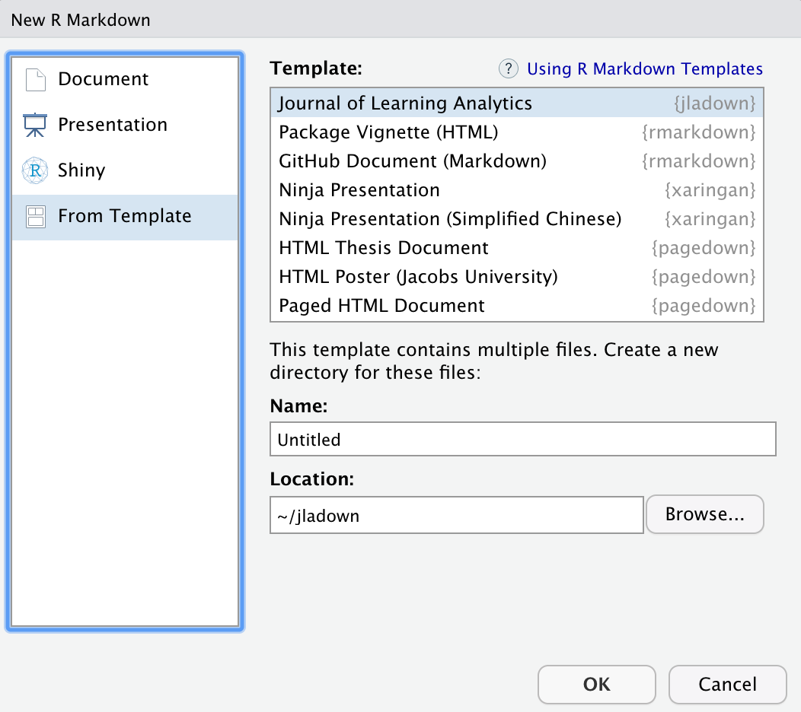

---
output:
  bookdown::github_document2:
    html_preview: false
---

<!-- README.md is generated from README.Rmd. Please edit that file -->

```{r, include = FALSE}
knitr::opts_chunk$set(
  collapse = TRUE,
  comment = "#>",
  fig.path = "man/figures/README-",
  out.width = "100%",
  tidy = "styler"
)
```

# jladown

<!-- badges: start -->
<!-- badges: end -->

## Background

While the [*Journal of Learning Analytics*](https://epress.lib.uts.edu.au/journals/index.php/JLA/index)
provides [Word document](https://drive.google.com/uc?export=download&id=1ST6Fr9w1xgpRK_2Xuhczhrxw98RFqYOI) and
[LaTeX](https://drive.google.com/uc?export=download&id=1LMkbm-HKAWliyTyRpzn1o0OxduJuVw7f) 
as templates, these can be challenging to use for a number of reasons, 
including the technical requirements of using a LaTeX template for the first 
time, the difficulty that manually editing a Word document poses.

Moreover, the imperative of producing reproducible analyses applies to including 
results in a manuscript, and yet reproducibility is a challenge for this step of
many author's process due to the need to manually enter (and interpret) results,
whether using a Word document or LaTeX template.

The goal of jladown is to provide a reproducible template for the *Journal of
Learning Analytics* using R Markdown in multiple formats, particularly pdf, but
also gitbook (for viewing via a web browser), and Word.

## Installation

`jladown` is currently under development on GitHub. Please install and test the 
package as follows:

```{r installation, eval = FALSE}
if(!require(remotes)) {
install.packages("remotes")
}

remotes::install_github('jooyoungseo/jladown')
```

## Example

This is a basic example which shows you how to use `jladown` package. While 
other formats are usable, `pdf` output is fully supported at this moment.

### Loading package

```{r, eval = FALSE}
library(jladown)
```

### For RStudio users

For RStudio users, as long as `jladown` is installed, you can create a project 
by creating a new R Markdown Document. From within RStudio, select "File" -> 
"New File" -> "R Markdown", and then select the *Journal of Learning Analytics* 
(`jladown) template, as in the below image.



### For non-RStudio users

For non-RStudio users (or those looking to use the command line), 
you may create a project template in the current path with the following 
function:

```{r, eval = FALSE}
jladown:::jladown_skeleton('.')
```

## Using the template (index.Rmd)

To use the template, open (if not alreay openeed) and edit the `index.Rmd` file.

We provide a brief overview of using the template here; 
see the template for more specific details.

### Front matter

First, edit the following key fields in the front-matter (which is 
in the [YAML format](https://yaml.org/):

- Title
- Author
- Affiliation
- Keywords
- Abstract

<!-- I'm not sure that the next line is true, and so I commented it out for now: -->

<!-- We note that fields that are not edited will not be included in the rendered -->
<!-- document. -->

### Body

Edit the body as you would any document. The `#` symbol represents a header; 
additional `#` symbols represent different levels of headers, as follows:

- `#`: Level-1 header
- `##`: Level-2 header
- `###`: Level-3 header
- `####`: Level-4 header

Text can be italicized using the `*` symbol, as with the following text:
*emphasized statement*.

Code can be included with 
[R Markdown code chunks](https://rmarkdown.rstudio.com/lesson-3.html); 
images not generated from code in these chunks can be included in a chunk via 
the function `knitr::include_graphics()`.

### References

References can be included in [BibTeX format]
(http://www.bibtex.org/) using [the apacite format]
(http://ctan.uniminuto.edu/biblio/bibtex/contrib/apacite/apacite.pdf)

# To-Do List

- [x] Add auto-word-counting capability using `rmdfiltr` package internally.
- [ ] Fix `template.docx` does not take any effect on `jladown::jla_word()` output.
- [ ] Make a cover page including jla logo for `bookdown::gitbook()` output.
